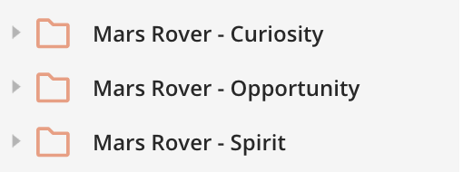

# 8

Now that we know more about our request, we can start implementing it in our code. Again, we will be using Axios to make our HTTP request. First, we will want to make a function called `getNeowsData()` and place Axios in there. We will also want to change our state inside of the function we just created and set it to the response from Axios. What is different now from before is that we will want to add two parameters: begin and end. Thus our function should look like `getNeowsData(begin, end)` to represent the user's input for the start and end date. Then, somewhere in our code, perhaps below the submit button, we can input a little text box like so:

## Mars Rover Pictures

For our next three implementations, we will need to grab pictures that three mars rovers have taken. Luckily enough, on the menu bar you should see these three folders:

Although we havn't opened the folder yet and have read their respective descriptions, we should have a good idea of what each one should do thanks to the folder names. We will visit the first folder, Mars Rover - Curiosity, and read its description to make sure this is what we want.

Based off of that description, we have come to the right place. Now we will have to choose between the two APIs on which is the correct one. Of the two, this should stand out more:

Although there are no descriptions for either API, we can judge based off of their parameters and name that this is what we will want as earth date is more commonly uded than sol. With the API link found and the parameters known, we are now ready for testing in postman.

