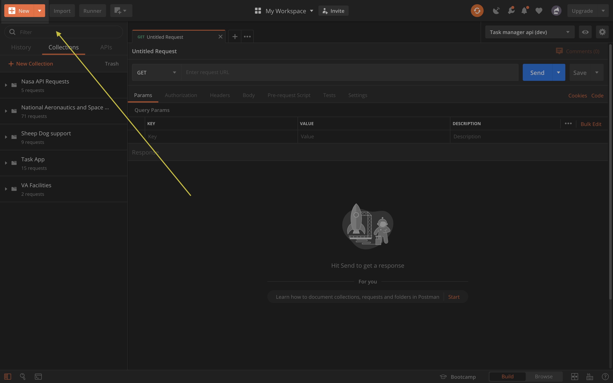
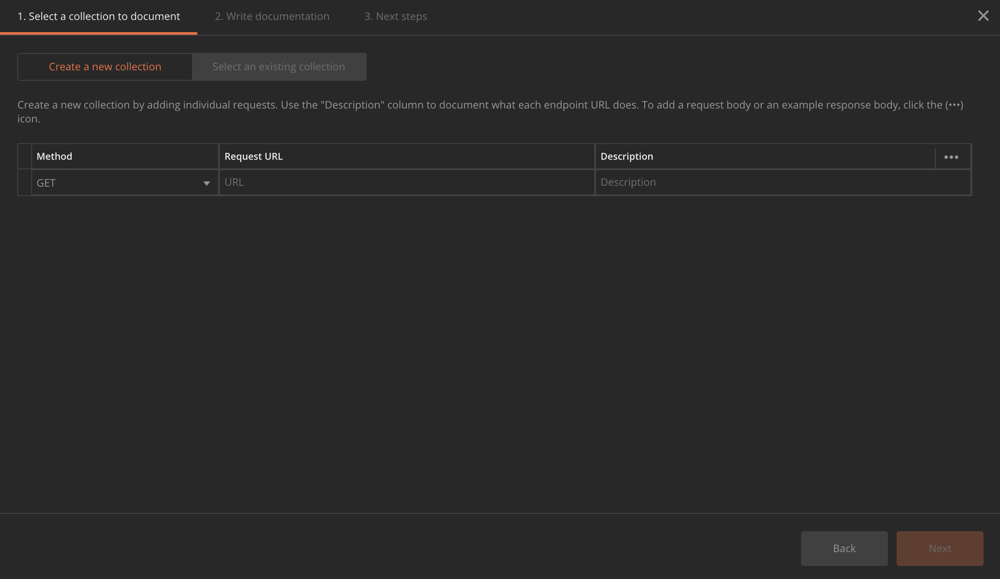

# 3

Now that you know the importance of API documentation, we can start documenting! In our previous activity, we used 5 different APIs in our web application. To document them, we will be using Postman's easy to use API documenter.

To get started, click the "New" button on the top left corner in the postman documentation.

Then, choose the "API documentation option". This will lead to the creation of a collection, which in turn will lead to the publication of our API documentation. After choosing the API documentation option, you should see the following screen:

